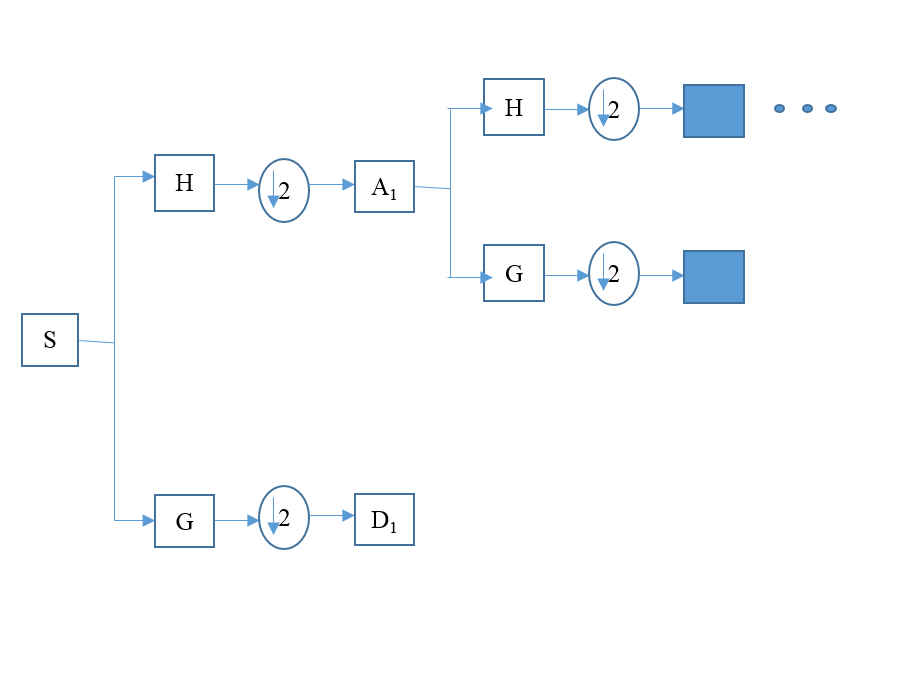
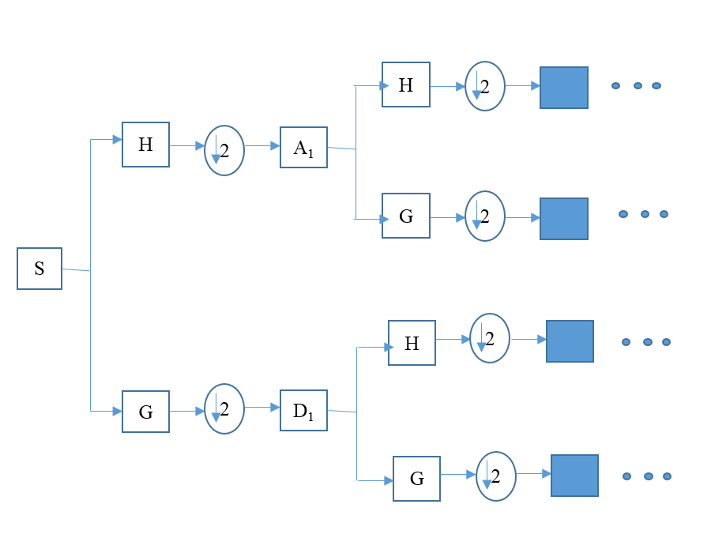

(Before reading this article, take a look at [this link](https://github.com/biswajitsahoo1111/cbm_codes_open/blob/master/notebooks/SVM_multiclass_time.pdf) for comparison)

This is the second post on multiclass classification using SVM. In the last article, we had used time domain features as input to SVM and seen its results. Here, we will apply SVM on wavelet packet energy features and obtain slightly higher accuracy as compared to previous case. We will again use [Case Western Reserve University Bearnig](https://csegroups.case.edu/bearingdatacenter/pages/welcome-case-western-reserve-university-bearing-data-center-website) data set for our multiclass classification problem.

## Description of data set

(We will use the same data set and the description is same as previous case. We will repeat the same thing here for the sake of completeness and to make it independent of previous one.)

A bearing has four major parts: inner race, outer race, rolling element and cage. Fault can occur in any of these components. The CWRU data set contains bearing data consisting of inner race fault, outer race fault and ball defect. A baseline (normal) bearing data with no faults is also available. Some data are collected with a sampling frequency of 12 kHz and some other are collected with 48 kHz. In this study we will only consider data acquired with 48 kHz sampling frequency. The faults have varying fault depths (0.007 inch, 0.014 inch, 0.021 inch). There is also load variation in motor (No load, 1 hp, 2 hp, 3hp). For this study we consider all the case with 1 hp external load.

There are 10 class for this external load (1 hp). The classes are:


* C1  : Ball defect (0.007 inch)
* C2  : Ball defect (0.014 inch)
* C3  : Ball defect (0.021 inch)
* C4  : Inner race fault (0.007 inch)
* C5  : Inner race fault (0.014 inch)
* C6  : Inner race fault (0.021 inch)
* C7  : Normal
* C8  : Outer race fault (0.007 inch, data collected from 6 O'clock position)
* C9  : Outer race fault (0.014 inch, 6 O'clock)
* C10 : Outer race fault (0.021 inch, 6 O'clock)

## Solution Approach

Our task is to classify these 10 types of fault given time data. There are many approaches to solve this. We will take one known as 'Shallow Approach'. In the age of deep learning these methods are shallow for several reasons. These methods require hand crafted features to be designed and fed into the learning algorithm. Another name for shallow approach is feature based approach. We will use support vector machine (SVM) to do the classification. We will apply other techniques including deep learning techniques in later posts. 

Wavelet analysis is a signal processing technique that gives us time-frequency representation. The inner workings of wavelets are different than traditional time-frequency methods (for example, spectrograms). We will not go into the details of wavelets here (It is saved for a later post.). Wavelet packets are a way of segregating a signal into different frequency bands. A pictorial representation will make the difference between wavelets and wavelet packets clear. (Note on notation: S-Signal, H- Low pass filter, G- High pass filter, $\downarrow 2$ - Downsampling by factor of 2, A1- Approximation coefficients corresponding to low frequency, D1- Detail coefficients corresponding to high frequency)




In wavelet packet transform, after three stages of transformation we get 8 nodes. From each node coefficients we reconstruct the signal and obtain its energy. Thus we get 8 energy features and because these energies are calculated from wavelet packets, we call these wavelet packet energy features. There are many mother wavelets that can be used (for example, Haar, Sym8, Daubechies, etc.). We have used 'Sym8' as a shrinked version of it can approximate impulses well. 

Here is how we form feature matrix. First data for each fault type are collected and segmented into smaller parts. In our case, one segment for each fault type contains 2048 data points. Then 8 wavelet packet features for each segment are calculated and assembled in a feature matrix. There are 200 segments for each fault and we have taken 8 wavelet packets. (We could also have considered 16 wavelet packet thus getting 16 wavelet packet features. But we have stopped at 8 as is usually done in research.) Thus our feature matrix is of size $(2000 \times 8)$. One column containing fault type is also added to the feature matrix. Thus final feature matrix is of size $(2000 \times 9)$. 

Before applying SVM, the data are first separated into a training set and a test set. The test set contains 50 rows of fault matrix chosen for each fault type. Thus its size is $(500 \times 9)$. The rest are taken as training set. 

SVM is applied to training set data and best parameters are chosen by cross validation. The best parameters are then applied to test set data to predict final classification result. We have not printed the intermediate results. Readers can easily print those as per requirement.


## Codes

```{r setup}
library(reticulate)
use_condaenv("r-reticulate")
```
First get the data from [here](https://github.com/biswajitsahoo1111/cbm_codes_open/blob/master/data/feature_matrix_wav_energy8_48k_2048_load_1.csv). Save the data in a folder and read it from that folder. 
```{r}
library(e1071)
data_wav_energy = read.csv('./feature_matrix/48k/feature_matrix_wav_energy8_48k_2048_load_1.csv',header = T)
# Change the above line to include your folder that contains data
set.seed(1)
index = c(sample(1:200,50),sample(201:400,50), sample(401:600,50),
          sample(601:800,50),sample(801:1000,50),sample(1001:1200,50),
          sample(1201:1400,50),sample(1401:1600,50),sample(1601:1800,50),
          sample(1801:2000,50))

train_data = data_wav_energy[-index,]
test_data = data_wav_energy[index,]

# Shuffle data
train_data = train_data[sample(nrow(train_data)),]
test_data = test_data[sample(nrow(test_data)),]
```
We apply cross-validation over a different set of parameters to obtain best set of parameters. This cross-validation is done by the 'tune' command and the parameters considered are the cost and gamma values as mentioned in the codes. Radial basis is used. The command 'svm_tune$best.model' is the best model obtained from cross validation. This model is used in later lines. 
```{r}
set.seed(11)
svm_tune = tune(svm,train_data[,-dim(train_data)[2]],
                train_data[,dim(train_data)[2]],kernel = 'radial',
                ranges = list(cost = c(0.01,1,10,50,100,200),
                              gamma = c(0.05,0.1,0.5,1,5)))
pred_train = predict(svm_tune$best.model,train_data[,-dim(train_data)[2]])
pred_test = predict(svm_tune$best.model,test_data[,-dim(train_data)[2]])
# Confusion matrix
train_confu = table(train_data[,dim(train_data)[2]],pred_train)
test_confu = table(test_data[,dim(train_data)[2]],pred_test)
```
Finally, we will use python's seaborn package to visualize confusion matrix for both training and test data. [RStudio](https://www.rstudio.com/) makes it convenient to run both R and Python scripts simultaneously. RStudio is great!
```{python}
import seaborn as sns
import matplotlib.pyplot as plt
fault_type = ['C1','C2','C3','C4','C5','C6','C7','C8','C9','C10']
plt.figure(1)
sns.heatmap(r.train_confu, annot= True, fmt = "d",
xticklabels=fault_type, yticklabels=fault_type)
plt.title('Training Confusion Matrix')
plt.xlabel('Predicted')
plt.ylabel('True')
plt.show()
plt.figure(2)
sns.heatmap(r.test_confu, annot = True, fmt = "d",
xticklabels=fault_type, yticklabels=fault_type)
plt.title('Test Confusion Matrix')
plt.xlabel('Predicted')
plt.ylabel('True')
plt.show()
```
It can be seen that we have obtained slightly higher accuracy as compared to time domain features. We could also have used wavelet packet entropy instead of wavelet packet energy. This will be done in a future post. Also read the notes below.

## Note: 

* Data for each case contains both drive end measurements and fan end measurements. For our study we have taken drive end measurements. Another point to note is that our segments are non-overlapping and each has 2048 data points. It turns out that from the original data 230 segments of 2048 data points each can be obtained for each fault type. But in out study we have taken first 200 segments for each fault type. 

* Regarding hyper parameters of SVM, reader are encouraged to try different cost functions. Trying a higher cost allows for more misclassified points while training. For this case and the previous case, slight improvements can be obtained in test accuracy by using a higher cost values. We have set the upper value of cost to be 200 for no good reason. 

* Finally, more details about wavelet packet features and the ways (with codes) to computed them will appear in a future post. For the time being, readers can download and use the feature matrix already created by us.

[R markdown file of this document](https://github.com/biswajitsahoo1111/cbm_codes_open/blob/master/notebooks/SVM_wavelet_energy_multiclass_cwru.Rmd)

Last updated: 17$^{th}$ May, 2019